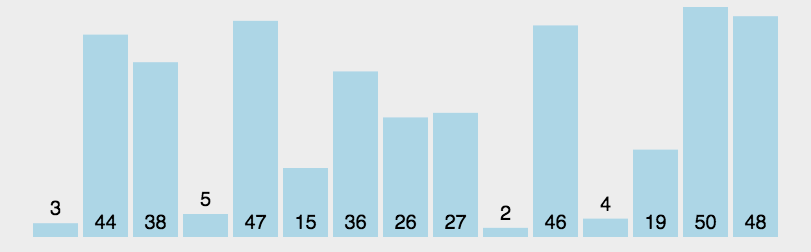

# 排序

> [原文链接](https://www.cnblogs.com/cnxkey/articles/9175489.html)

## 复杂度

> 

1. n: 数据规模
1. k: 桶的个数
1. In-place/Out-place:占用常数内存，不占用额外内存 / 占用额外内存
1. 稳定性:排序后 2 个相等值的先后顺序不变

## 冒泡排序


```js
function bubbleSort(arr) {
  var len = arr.length;
  for (var i = 0; i < len - 1; i++) {
    for (var j = 0; j < len - i; j++) {
      if (arr[j] > arr[j + 1]) {
        var t = arr[j];
        arr[j] = arr[j + 1];
        arr[j + 1] = t;
      }
    }
  }
}
```

> 优化: 立一个 flag，第二层循环没有交换，则无需排序，退出第一、二层循环即可

## 选择排序


每次挑选最小的值放在 i 位置上

```js
function selectionSort(arr) {
  var len = arr.length;

  for (var i = 0; i < len - 1; i++) {
    var minIndex = i;
    for (var j = i + 1; j < len; j++) {
      if (arr[j] < arr[minIndex]) {
        minIndex = j;
      }
    }
    if (minIndex !== i) {
      var t = arr[i];
      arr[i] = arr[minIndex];
      arr[minIndex] = t;
    }
  }
}
```

## 插入排序


和 arr[i]元素进行比较，如果小则右移一位

```js
function insertionSort(arr) {
  var len = arr.length;
  for (var i = 1; i < len; i++) {
    var insertIndex = i - 1;
    var currentValue = arr[i];

    while (insertIndex >= 0 && arr[insertIndex] > currentValue) {
      arr[insertIndex + 1] = arr[insertIndex]; // 将值后移一位
      insertIndex--; // 向左继续比较
    }
    // 此时insertIndex为-1或者已经找到比currnetValue小的值了
    // insertIndex + 1才是应该插入值的位置
    arr[insertIndex + 1] = currentValue;
  }
}

function insertionSortFor(arr) {
  var len = arr.length;
  for (var i = 0; i < len; i++) {
    var compareValue = arr[i];
    for (var j = i - 1; j >= 0; j--) {
      // 从i - 1开始
      if (arr[j] > compareValue) {
        // 向右推一位
        arr[j + 1] = arr[j];
      } else {
        break;
      }
    }
    arr[j + 1] = compareValue;
  }
}
```

## 希尔排序

希尔排序是插入排序的一种更高效率的实现。它与插入排序的不同之处在于，它会优先比较距离较远的元素。希尔排序的核心在于间隔序列的设定。既可以提前设定好间隔序列，也可以动态的定义间隔序列。动态定义间隔序列的算法是《算法（第 4 版》的合著者 Robert Sedgewick 提出的。在这里，我就使用了这种方法。

```js
function shellSort(arr) {
  var len = arr.length,
    temp,
    gap = 1;
  while (gap < len / 3) {
    //动态定义间隔序列
    gap = gap * 3 + 1;
  }
  for (gap; gap > 0; gap = Math.floor(gap / 3)) {
    for (var i = gap; i < len; i++) {
      temp = arr[i];
      for (var j = i - gap; j >= 0 && arr[j] > temp; j -= gap) {
        arr[j + gap] = arr[j];
      }
      arr[j + gap] = temp;
    }
  }
  return arr;
}
```

## 归并排序


```js
function mergeSort(arr) {
  //采用自上而下的递归方法
  var len = arr.length;
  if (len < 2) {
    return arr;
  }
  var middle = Math.floor(len / 2),
    left = arr.slice(0, middle),
    right = arr.slice(middle);

  return merge(mergeSort(left), mergeSort(right));
}

function merge(left, right) {
  var result = [];

  while (left.length && right.length) {
    if (left[0] <= right[0]) {
      result.push(left.shift());
    } else {
      result.push(right.shift());
    }
  }

  return result.concat(left, right);
}
```

## 快速排序



```js
function quickSort(arr, left = 0, right = arr.length - 1) {
  if (left >= right) {
    //如果左边的索引大于等于右边的索引说明整理完毕
    return;
  }
  let i = left;
  let j = right;
  const baseVal = arr[j]; // 取无序数组最后一个数为基准值
  while (i < j) {
    //把所有比基准值小的数放在左边大的数放在右边
    while (i < j && arr[i] <= baseVal) {
      //找到一个比基准值大的数交换
      i++;
    }
    arr[j] = arr[i]; // 将较大的值放在右边如果没有比基准值大的数就是将自己赋值给自己（i 等于 j）
    while (j > i && arr[j] >= baseVal) {
      //找到一个比基准值小的数交换
      j--;
    }
    arr[i] = arr[j]; // 将较小的值放在左边如果没有找到比基准值小的数就是将自己赋值给自己（i 等于 j）
  }
  arr[j] = baseVal; // 将基准值放至中央位置完成一次循环（这时候 j 等于 i ）
  sort(arr, left, j - 1); // 将左边的无序数组重复上面的操作
  sort(arr, j + 1, right); // 将右边的无序数组重复上面的操作
}
```

## 堆排序


```js
var len; //因为声明的多个函数都需要数据长度，所以把len设置成为全局变量

function buildMaxHeap(arr) {
  //建立大顶堆
  len = arr.length;
  for (var i = Math.floor(len / 2); i >= 0; i--) {
    heapify(arr, i);
  }
}

function heapify(arr, i) {
  //堆调整
  var left = 2 * i + 1,
    right = 2 * i + 2,
    largest = i;

  if (left < len && arr[left] > arr[largest]) {
    largest = left;
  }

  if (right < len && arr[right] > arr[largest]) {
    largest = right;
  }

  if (largest != i) {
    swap(arr, i, largest);
    heapify(arr, largest);
  }
}

function swap(arr, i, j) {
  var temp = arr[i];
  arr[i] = arr[j];
  arr[j] = temp;
}

function heapSort(arr) {
  buildMaxHeap(arr);

  for (var i = arr.length - 1; i > 0; i--) {
    swap(arr, 0, i);
    len--;
    heapify(arr, 0);
  }
  return arr;
}
```

## 计数排序

计数排序要求输入的数据必须是有确定范围的整数


```js
function countingSort(arr, maxValue) {
  var bucket = new Array(maxValue + 1),
    sortedIndex = 0;
  (arrLen = arr.length), (bucketLen = maxValue + 1);

  for (var i = 0; i < arrLen; i++) {
    if (!bucket[arr[i]]) {
      bucket[arr[i]] = 0;
    }
    bucket[arr[i]]++;
  }

  for (var j = 0; j < bucketLen; j++) {
    while (bucket[j] > 0) {
      arr[sortedIndex++] = j;
      bucket[j]--;
    }
  }

  return arr;
}
```

## 桶排序

桶排序是计数排序的升级版。它利用了函数的映射关系，高效与否的关键就在于这个映射函数的确定。

为了使桶排序更加高效，我们需要做到这两点：

在额外空间充足的情况下，尽量增大桶的数量
使用的映射函数能够将输入的 N 个数据均匀的分配到 K 个桶中
同时，对于桶中元素的排序，选择何种比较排序算法对于性能的影响至关重要。

什么时候最快
当输入的数据可以均匀的分配到每一个桶中

什么时候最慢
当输入的数据被分配到了同一个桶中

```js
function bucketSort(arr, bucketSize) {
  if (arr.length === 0) {
    return arr;
  }

  var i;
  var minValue = arr[0];
  var maxValue = arr[0];
  for (i = 1; i < arr.length; i++) {
    if (arr[i] < minValue) {
      minValue = arr[i]; //输入数据的最小值
    } else if (arr[i] > maxValue) {
      maxValue = arr[i]; //输入数据的最大值
    }
  }

  //桶的初始化
  var DEFAULT_BUCKET_SIZE = 5; //设置桶的默认数量为5
  bucketSize = bucketSize || DEFAULT_BUCKET_SIZE;
  var bucketCount = Math.floor((maxValue - minValue) / bucketSize) + 1;
  var buckets = new Array(bucketCount);
  for (i = 0; i < buckets.length; i++) {
    buckets[i] = [];
  }

  //利用映射函数将数据分配到各个桶中
  for (i = 0; i < arr.length; i++) {
    buckets[Math.floor((arr[i] - minValue) / bucketSize)].push(arr[i]);
  }

  arr.length = 0;
  for (i = 0; i < buckets.length; i++) {
    insertionSort(buckets[i]); //对每个桶进行排序，这里使用了插入排序
    for (var j = 0; j < buckets[i].length; j++) {
      arr.push(buckets[i][j]);
    }
  }

  return arr;
}
```

### 基数排序

基数排序有两种方法

MSD 从高位开始进行排序
LSD 从低位开始进行排序
基数排序 vs 计数排序 vs 桶排序
这三种排序算法都利用了桶的概念，但对桶的使用方法上有明显差异：

基数排序：根据键值的每位数字来分配桶
计数排序：每个桶只存储单一键值
桶排序：每个桶存储一定范围的数值
LSD 基数排序动图演示：


```js
var counter = [];
function radixSort(arr, maxDigit) {
  var mod = 10;
  var dev = 1;
  for (var i = 0; i < maxDigit; i++, dev *= 10, mod *= 10) {
    for (var j = 0; j < arr.length; j++) {
      var bucket = parseInt((arr[j] % mod) / dev);
      if (counter[bucket] == null) {
        counter[bucket] = [];
      }
      counter[bucket].push(arr[j]);
    }
    var pos = 0;
    for (var j = 0; j < counter.length; j++) {
      var value = null;
      if (counter[j] != null) {
        while ((value = counter[j].shift()) != null) {
          arr[pos++] = value;
        }
      }
    }
  }
  return arr;
}
```
